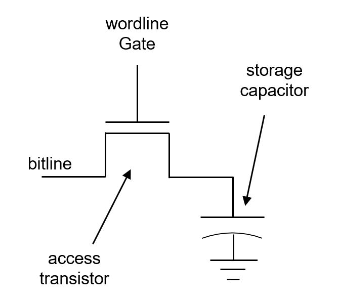

> **DDR SDRAM CONTROLLER**

DDR stands for _Double Data Rate_ and SDRAM stands for Synchronous DRAM (Dynamic Random Access Memory). A DDR-SDRAM controller is a device which synchronizes the commands to DRAM with clock and timely refresh so as to not lose data. 

To start with we have to understand why we need to refresh DRAM.

The capacitor on the left side of transitory looses charge with time, the charge precisely stores our information. Hence, the loss of charge can lead to loss of information, so it must be refreshed i.e charged in order to retain information. 

A DRAM synchronized with the system is done using a controller. The question still to answered is what DDR actually means : In basic terms the work will happen on both the positive and negative edge of the clock hence the word "Double". 

The aim of this project for me is to understand the architecture of DDR SDRAM controller and implement it in either FPGA or RTL to GDSII. Time being my goal is to realize its RTL.
For reference I am following the. Altera "DDR SDRAM Controller White Paper"

